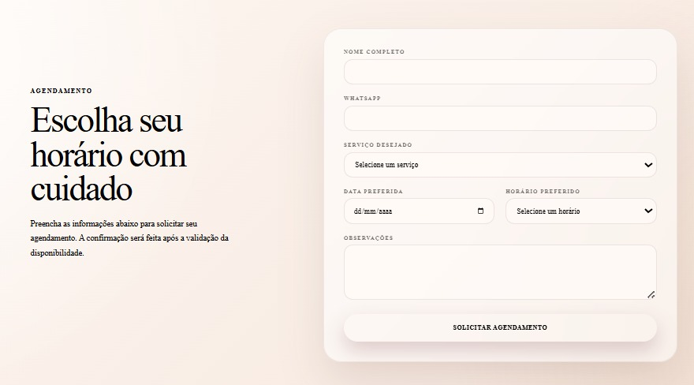

<div align="center">

  <br />
  
  <br />
  <br />

  # JC BEAUTY STUDIO
  ### *Lash Designer*

  **Full-Stack Appointment & Business Management System**

  `React` • `TypeScript` • `Node.js` • `Prisma`

  <br />

  <!-- Badges -->
  <p align="center">
    
    
    
    
    
    
  </p>

  <br />

  <p align="center">
    <a href="#-sobre-o-projeto">Sobre</a> •
    <a href="#-funcionalidades">Funcionalidades</a> •
    <a href="#-screenshots">Screenshots</a> •
    <a href="#-arquitetura-da-aplicação">Arquitetura</a> •
    <a href="#-como-executar-o-projeto">Como Executar</a> •
    <a href="#-api-reference-resumo-de-endpoints">API</a>
  </p>

</div>

---

---

## 📌 Sobre o Projeto

O **JC Beauty Lash Designer** é um sistema completo (*Full-Stack*) projetado para centralizar a presença digital e automatizar a gestão operacional de um estúdio especializado em extensão de cílios.

A plataforma conecta a **experiência do cliente** (agendamento intuitivo, vitrine de serviços e checagem de horários em tempo real) a um **painel administrativo seguro** que gerencia agenda, clientes, serviços, relatórios e métricas financeiras.

---

## ✨ Funcionalidades

### 🛍️ Área do Cliente (Landing Page & Agendamento)
- **Hero Banner Institucional:** Apresentação da marca, proposta de valor e Call-to-Actions rápidos.
- **Vitrine de Serviços Exclusiva:** Catálogo com preços, tempo de procedimento e opções de *Aplicação* ou *Manutenção* (Brasileiro, Egípcio, Fio a Fio).
- **Agendamento Inteligente:** Seleção de datas e verificação de horários disponíveis em tempo real sem conflitos.
- **Canais de Contato Rápidos:** Integração direta com WhatsApp e Instagram.
- **Informativos Legais:** Seções dedicadas para FAQ, Termos de Uso e Política de Privacidade.

### 🛡️ Dashboard Administrativo
- **Autenticação Segura:** Login protegido via JSON Web Tokens (JWT) e senhas criptografadas.
- **Gestão de Agenda & Timeline:** Visualização e atualização de status de agendamentos em tempo real.
- **Módulo Financeiro & Relatórios:** Acompanhamento de receitas, balanços e métricas de desempenho.
- **Cadastro de Clientes & Serviços:** Controle detalhado do histórico de atendimentos e catálogo de preços/durações.
- **Configurações Globais:** Ajustes de dias úteis, horários de funcionamento e regras de negócio.

---

## 📸 Screenshots

## 📸 Screenshots

<div align="center">

### 1️⃣ Landing Page Principal


<br /><br />

### 2️⃣ Catálogo de Serviços


<br /><br />

### 3️⃣ Formulário de Agendamento Online


</div>

---

## 📐 Arquitetura da Aplicação

```mermaid
graph TD
    Client[Cliente / Browser] -->|HTTP / HTTPS| Frontend[Frontend: React + Vite + TS]
    Admin[Administrador] -->|Autenticação JWT| Frontend
    
    Frontend -->|REST API Requests| Backend[Backend: Node.js + Express]
    
    subgraph Servidor Backend
        Backend --> Auth[Middleware JWT]
        Backend --> Controllers[Controllers & Routes]
        Backend --> Services[Business Logic]
    end
    
    Services -->|Prisma Client| ORM[Prisma ORM]
    ORM -->|SQL Queries| DB[(Database: SQLite)]
